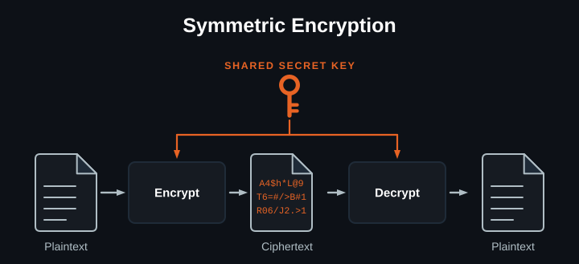
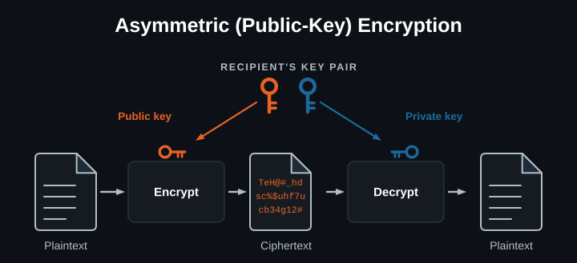
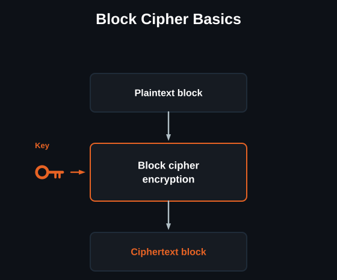
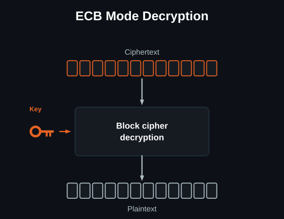
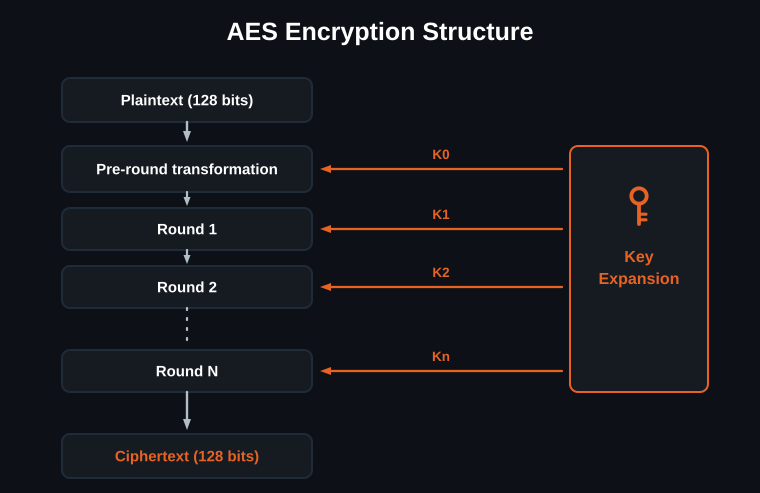
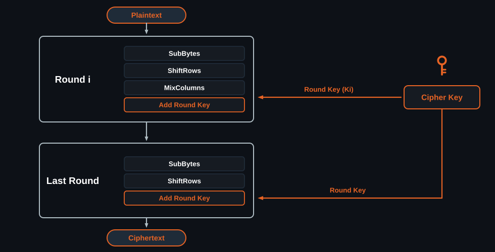
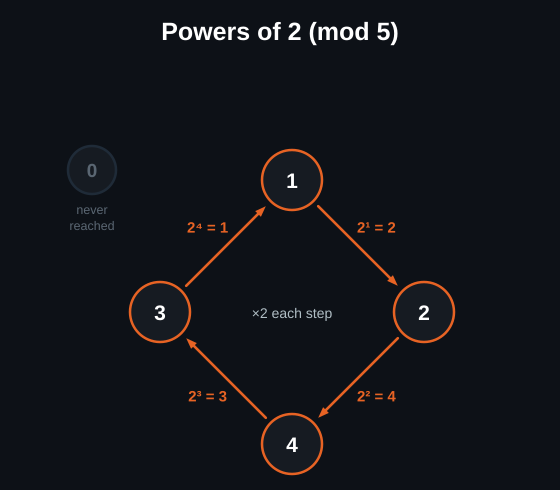
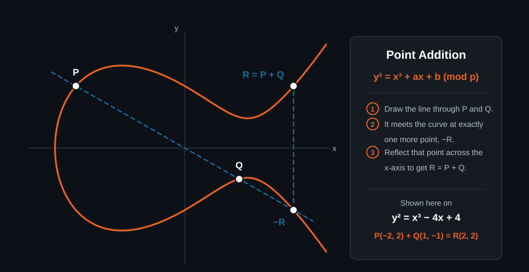

[Slides on Auburn Box](https://auburn.box.com/s/mrruik8nn1wvntyeiyuv2ra6o4womstf)

## Introduction

### Core applications

**Communications**

- **E2EE** is becoming standard for direct messaging
- TLS/SSL (HTTPS), SSH, instant messaging
- Used to store secret data, or to message authorized parties
- A core part of **IPsec** (routing, DNS, tunneling)
- The **PGP suite** allows both encryption and signing

**Credentials**

- Confirming someone is who they say they are
- **Account passwords**, local and cloud
- The **802.11 suite**: WPA2, WPA3
- **Authentication:** EAP, MSCHAPv2
- **Disk and file encryption**

### Encryption types

**Symmetric**

- The key is **pre-shared** between client and recipient
- The same key both encrypts and decrypts the message
- Extremely fast, and **hardware-accelerated**



**Asymmetric (public-key)**

- Two keys, **public** and **private**
- Often used to exchange credentials or verify authenticity
- *Encryption:* encrypt with the recipient's public key. Only their private
  key can decrypt it
- *Authentication:* sign with your private key, and anyone holding your public
  key can verify it



### Key types

| | Type | Relies on |
| :--- | :--- | :--- |
| **RSA** (Rivest-Shamir-Adleman) | Asymmetric | Factorization of large numbers, and modular arithmetic |
| **AES** (Advanced Encryption Standard) | Symmetric block cipher | Confusion and diffusion |
| **ECC** (Elliptic Curve Cryptography) | Asymmetric | The elliptic curve discrete logarithm problem (ECDLP) |

## RSA

### Key generation

RSA rests on a **trapdoor function**: easy to produce, difficult to reproduce.
`N = p × q`, where p and q are large primes.

**Euler's totient function φ(n)** counts the positive integers up to n that are
relatively prime to n, the ones sharing no factor with n other than 1.

For `n = 9`, the integers are {1,2,3,4,5,6,7,8,9}. Those with a common factor
are {3,6,9}, leaving totatives {1,2,4,5,7,8}, so `φ(9) = 6`.

For `n = 15`, since 15 = 3 × 5 and both are prime,
`φ(15) = φ(3) × φ(5) = (3−1) × (5−1) = 2 × 4 = 8`, with totatives
{1,2,4,7,8,11,13,14}.

### Implementation

1. Compute `N = p × q`
2. Compute `φ(N) = (p−1)(q−1)`
3. **Public exponent:** choose `e` with `1 < e < φ(N)` and `gcd(e, φ(N)) = 1`
4. **Private exponent:** `d` where `e × d ≡ 1 (mod φ(N))`
5. **Public key** is `(N, e)`; **private key** is `(N, d)`
6. **Encryption:** `C = Mᵉ (mod N)`
7. **Decryption:** `M = Cᵈ (mod N)`

Worked through with `p = 3` and `q = 11`:

```text
n   = 3 × 11 = 33
φ(n) = (3−1)(11−1) = 20
e   = 3            gcd(3, 20) = 1
d   = 7            3d ≡ 1 (mod 20)

Public key (33, 3)   Private key (33, 7)

Encrypt m = 7:   c = 7³  (mod 33) = 343 (mod 33) = 13
Decrypt c = 13:  m = 13⁷ (mod 33) = 7
```

The decryption step is cheaper than it looks, because you never compute 13⁷ in
full. You reduce as you go:

```text
13¹ ≡ 13          (mod 33)
13² ≡ 169 ≡ 4     (mod 33)
13⁴ ≡ 4²  ≡ 16    (mod 33)
13⁷ = 13⁴ · 13² · 13¹
    ≡ 16 · 4 · 13 (mod 33)
    ≡ 64 · 13 ≡ (−2) · 13
    ≡ −26 ≡ 7     (mod 33)
```

### Specs and tradeoffs

- **Typical key sizes:** 2048-bit is the current standard, 4096-bit for high
  security
- **Primes p and q:** hundreds of digits long, so 300+ digits for a 2048-bit key
- **Common public exponent:** usually 65537 (2¹⁶ + 1)

| Advantages | Disadvantages |
| :--- | :--- |
| Simple and versatile | Computationally expensive |
| Proven reliable, in use since 1977 | Large key sizes |
| Hardware accelerated | Easy to predict, so there are side-channel risks |
| Asymmetric | Quantum threat |

## AES

### Block cipher algorithm

A block cipher takes a fixed-length block of plaintext and a secret key, and
transforms them into a block of ciphertext of the same length.

- **Block size:** commonly 64 or 128 bits. Messages shorter than the block are
  padded.
- **Rounds:** the algorithm performs a series of repetitive operations, such as
  substitution and diffusion.





### Confusion and diffusion

**Confusion** substitutes each byte through a nonlinear lookup table (the
S-box), which makes the relationship between key and ciphertext complex and
unpredictable. A Caesar cipher is the toy version:

```text
Text:   ABCDEFGHIJKLMNOPQRSTUVWXYZ
Shift:  23
Cipher: XYZABCDEFGHIJKLMNOPQRSTUVW
```

**Diffusion** shuffles and mixes bytes across the block. The **avalanche
effect** is the result: a single changed input bit affects roughly half the
output bits after a few rounds. The toy version is a transposition, where
`abcd` becomes `dabc`.

### How AES works

- **Symmetric** algorithm
- **Key sizes:** 128, 192, or 256 bits
- **Block size:** fixed at 128 bits
- **Structure:** a substitution-permutation network (SPN)
- **Rounds:** 10 for 128-bit keys, 12 for 192-bit, 14 for 256-bit





### Uses and tradeoffs

- **File encryption:** securing hard drives
- **Secure communication:** encrypting the TLS/SSL data stream
- **Wireless security:** WPA2 and WPA3
- **Government standards:** Top Secret data protection globally

| Advantages | Disadvantages |
| :--- | :--- |
| Speed | Key distribution |
| Secure | Implementation complexity |
| Hardware accelerated | Low memory |

## ECC

### Math refresh

**Linear (continuous) logarithms** are the inverse of exponents. Given
`bˣ = y`, the logarithm asks which exponent x produces y from base b. The power
rule gives `log(bˣ) = x · log(b)`, so `x = log(y) / log(b)`. Given `2ˣ = 32`,
`x = log(32)/log(2) = 5`.

**Modular (discrete) logarithms** ask the same question inside a modulus: given
`gˣ ≡ y (mod n)`, find x. The power rule no longer applies, and this is the
**discrete logarithm problem** (DLP). For small numbers it is relatively easy. Take `y = 3` and `g = 2 (mod 5)` and find x by hand. For large numbers it is
impossible.

### Discrete logarithms

Successive powers of `g = 2` modulo `n = 5`:

```text
2¹ ≡ 2  (mod 5)
2² ≡ 4  (mod 5)
2³ ≡ 3  (mod 5)   8  = 1 × 5 + 3
2⁴ ≡ 1  (mod 5)   16 = 3 × 5 + 1
2⁵ ≡ 2  (mod 5)   cycle repeats
```

The outputs follow no predictable order. For a 256-bit modulus the cycle length
is astronomically large, and the security rests on the computational
inefficiency of working backwards through it.



### Elliptic curves

An elliptic curve is defined as `y² = x³ + ax + b (mod p)`, where a, b, and p
are the parameters that pick out the specific curve. Only discrete integer
coordinate pairs `(x, y)` are valid points for cryptography.

**Point addition:** given two points A and B, their sum `A + B` is found by
drawing a line through A and B. That line makes a third intersection with the
curve, and that point is then reflected across the x-axis.



### ECC encryption

**Scalar multiplication** is the repeated addition of a point to itself:
`P = k × G`, where G is the generator point and k is the scalar.

- **Private key:** `k`, a randomly chosen large integer, kept secret
- **Public key:** `P`, the resulting point, shared openly

The **elliptic curve discrete logarithm problem** (ECDLP) is what makes this
useful. Computing P from k and G is fast; the reverse has no known
sub-exponential algorithm for elliptic curves.

## Conclusion

### Relevance for security

- **End-to-end encryption** means only you and your recipient can read your
  messages, not your ISP, the app company, or anyone else
- It protects you on networks you cannot control, such as public WiFi or an
  employer or school network
- It secures sensitive transactions, and is the backbone of trust in digital
  communications
- **Encrypted authentication** keeps your identity yours
- It protects your information even when companies get breached

**Logjam (2015)** was an attack on live TLS connections that exploited outdated
policy together with mathematical precomputation. It demonstrated that a
theoretical weakness can translate into a real, scalable attack. TLS still
supported weak encryption standards at the time; using Number Field Sieve
precomputation, a 512-bit key could be broken in a week. Most servers used the
same set of shared primes, so a one-time computation cost could instantly break
thousands of machines.

### Mesh networking relevance

- **Key distribution:** nodes join and leave a mesh dynamically, which makes safe
  distribution and routing difficult
- Most mesh networks rely on **asymmetric** approaches for the handshake, then
  **symmetric** encryption (AES) for bulk data
- **Multi-hop exposure:** every hop is a potential interception point, so E2EE
  is necessary
- **Node authentication:** RSA or ECC signatures prove identity without sharing
  a secret

### Future considerations

- **Shor's algorithm** is a quantum algorithm for finding the prime factors of
  an integer, and both RSA and ECC are vulnerable to it
- As quantum computing develops rapidly, quantum-resistant standards become
  necessary
- **Post-quantum cryptography:** NIST finalized standards in 2024, relying on
  the difficulty of lattice problems
- Migration to PQC is complex, and touches hardware, mesh networks, and existing
  infrastructure

## Sources

- [Symmetric vs Asymmetric Key Encryption](https://www.geeksforgeeks.org/computer-networks/difference-between-symmetric-and-asymmetric-key-encryption/) (GeeksforGeeks)
- [RSA Algorithm in Cryptography](https://www.geeksforgeeks.org/computer-networks/rsa-algorithm-cryptography/) (GeeksforGeeks)
- [Euler's Totient Function](https://www.geeksforgeeks.org/dsa/eulers-totient-function/) (GeeksforGeeks)
- [Advanced Encryption Standard (AES)](https://www.geeksforgeeks.org/computer-networks/advanced-encryption-standard-aes/) (GeeksforGeeks)
- [Block Cipher Modes of Operation](https://www.geeksforgeeks.org/ethical-hacking/block-cipher-modes-of-operation/) (GeeksforGeeks)
- [Difference between Confusion and Diffusion](https://www.geeksforgeeks.org/computer-networks/difference-between-confusion-and-diffusion/) (GeeksforGeeks)
- [Elliptic Curve Cryptography](https://www.geeksforgeeks.org/ethical-hacking/blockchain-elliptic-curve-cryptography/) (GeeksforGeeks)
- [Trapdoor function](https://en.wikipedia.org/wiki/Trapdoor_function) (Wikipedia)
- [RSA (cryptosystem)](https://en.wikipedia.org/wiki/RSA_(cryptosystem)) (Wikipedia)
- [Discrete logarithm](https://en.wikipedia.org/wiki/Discrete_logarithm) (Wikipedia)
- [Elliptic-curve cryptography](https://en.wikipedia.org/wiki/Elliptic-curve_cryptography) (Wikipedia)
- [Logjam](https://en.wikipedia.org/wiki/Logjam_(computer_security)) (Wikipedia)
- [Shor's algorithm](https://en.wikipedia.org/wiki/Shor%27s_algorithm) (Wikipedia)
- [Post-quantum cryptography](https://en.wikipedia.org/wiki/Post-quantum_cryptography) (Wikipedia)

<p class="lecture-note">
Diagrams on this page were made with Claude. Everything else is researched
and written by club members.
</p>
