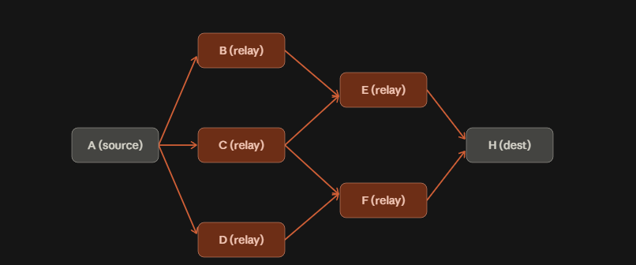
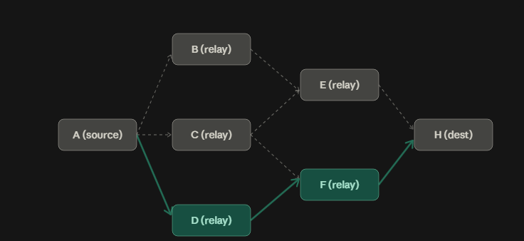
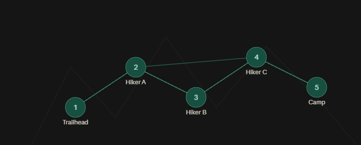
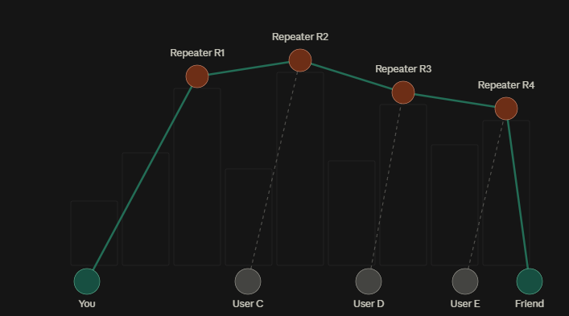

[Slides on Auburn Box](https://auburn.box.com/s/5hdgcaagiw4a7l15cztponmsbgmgzqm4)

## A brief history

### Meshtastic, the OG

Launched in 2019 as a solo effort by Kevin Hester, who wanted a better way to do
off-grid comms for outdoor activities.

- **2020:** prototyping with T-Beam boards
- **2021:** expansion to new hardware (RAK boards, T-Echo) and use in emergency
  communications
- **2022:** many new features and improvements: better routing, encryption,
  MQTT, and a Python API
- **2025:** version 2.6 ships a new routing algorithm, more similar to
  MeshCore's

### MeshCore, the new kid

MeshCore was developed most directly as a response to Cyclone Gabrielle in New
Zealand, as a backup for when normal communication methods go down.

Its developers looked at Meshtastic and aimed to solve its most apparent
problem: too many nodes in one area flood the network. 2025 saw rapid growth of
the platform as people observed the superior routing in dense areas.

## The routing solutions

### Meshtastic: flood always

Every communication floods until the hop limit is hit. That allows many paths
from sender to receiver, and it works great in small groups.

### MeshCore: flood first, then route

MeshCore floods on the first message to find a route, saves the route it found,
and then chooses that path going forward. It retries a flood after roughly four
failed attempts. This cuts down on messages flooding the network every time.

## Which to choose? Both

### Choose Meshtastic when

- Only a few nodes are required to let everyone on the network communicate
- Hiking, concerts, field days, any outdoor activity with a small group of
  mobile people

### Choose MeshCore when

- Planning a more permanent, city-wide network
- A large number of nodes need to be connected to the network
- Repeater infrastructure is set up

Diagrams on this page were made with Claude. Everything else is researched
and written by club members.

