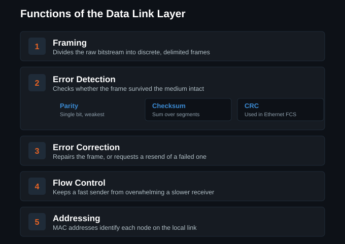
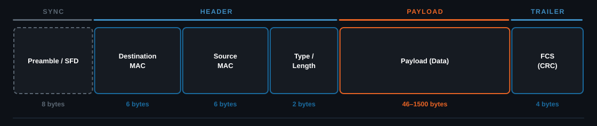
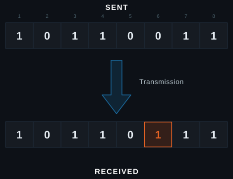
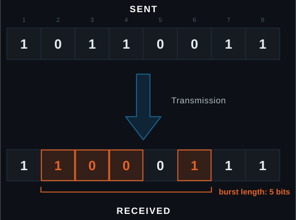
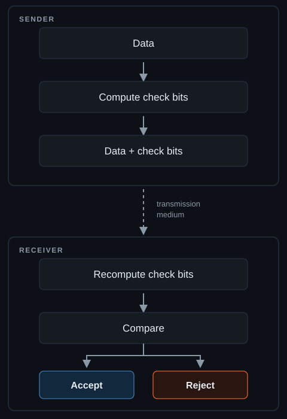
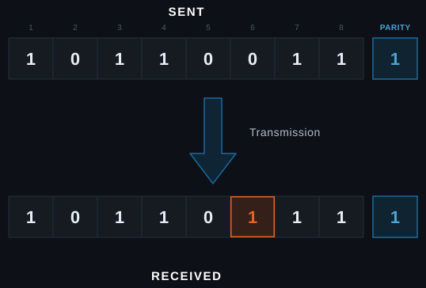
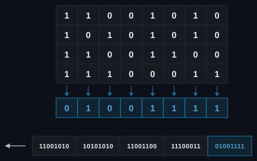
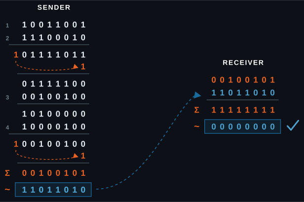
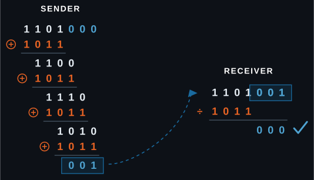

[Slides on Auburn Box](https://auburn.box.com/s/rbyd0l27ju2mj0lw30yxl3c5dzajh9qy)

## The OSI model

Open Systems Interconnection (OSI) comes from the International Organization
for Standardization (ISO). It is a common reference for how interconnection
standards get written: seven abstract layers describing communication from
physical bits on the medium up to a distributed application.

The model is simply a teaching abstraction, and is not something any real stack
implements. Working systems follow TCP/IP, which collapses layers 5, 6, and 7
into one application layer. However, when someone mentions "Layer 2," this is
what they mean.

For the rest of this lecture we'll be narrowing in on Layer 2.

### Layer 2: data link

Layer 2 moves data across a single link between two directly connected nodes.
If Layer 1 is the road, Layer 2 is the car that drives on it. It splits into two
sublayers:

- **Logical Link Control (LLC)** identifies the Layer 3 protocol inside the
  frame. In practice that is the only thing it does, and it shows up as the
  LLC/SNAP header on a Wi-Fi frame.
- **Media Access Control (MAC)** decides who may transmit, and defines the frame
  structure.

Flow control is one of the items not covered here. In practice, this is abstracted to higher layers.

## Framing

### Anatomy of an Ethernet frame (IEEE 802.3)

How Layer 2 wraps a Layer 3 packet for delivery across one link:

- **Preamble:** 7 bytes, letting the receiver lock onto the signal and know a
  frame is coming. The **SFD** (start frame delimiter) is 1 byte set to
  `10101011`, marking where the frame itself begins.
- **Addressing:** destination and source MAC addresses identify the NICs on the
  local segment.
- **Type / Length:** a value of 1500 or below is a length
- **Payload:** carries the Layer 3 packet handed down, so the IP header and its
  data when IP is in use. Padded up to 46 bytes if it is shorter.
- **Error check:** the frame check sequence holds a CRC-32 over the header and
  payload. It is not a cryptographic hash, just an error check, and the receiver
  drops any frame that fails it.

A MAC address is 48 bits, six hex bytes. The first three are the OUI, assigned
to the manufacturer by the IEEE, and the last three are the vendor's own device
number. Two bits in the first byte matter: the lowest bit marks a group
(multicast) address, and the next one up marks a locally administered address,
which is what a phone sets when it randomizes its MAC. `FF:FF:FF:FF:FF:FF` is
broadcast.

### Carrier Sense Multiple Access

CSMA is a MAC-layer scheme for sharing one channel among many stations.
Wireless devices cannot detect a collision while transmitting, so CSMA/CA avoids
one instead. Stations sense the channel and wait a random backoff before
sending, which makes collisions less likely, though two stations whose backoff
expires in the same slot will still collide.

- **Collision Avoidance (CSMA/CA)** keeps collisions from happening, and is used
  on wireless links
- **Collision Detection (CSMA/CD)** spots a collision during transmission and
  aborts. Wired half-duplex Ethernet only.
- **Request-to-Send / Clear-to-Send (RTS/CTS)** is optional, and off by default
  on most gear

A radio needs CSMA because it cannot hear a collision while it is transmitting,
radio time costs power, and interference is everywhere.

- **Pros:** efficient, simple, flexible, and cheap
- **Cons:** scales poorly, adds delay, guarantees no delivery, and is easy to jam

**Features**

- **Carrier sensing:** stations listen to the channel before transmitting
- **Collision avoidance:** a random backoff prevents overlaps
- **Acknowledgements:** the receiver confirms every unicast frame it accepts.
  Broadcast and multicast go unacknowledged.
- **Fairness:** no one station can monopolize the channel
- **Binary exponential backoff:** the contention window doubles after each
  failed attempt

**Strategies used**

- **Interframe Space (IFS):** a fixed idle gap after the channel clears, so
  replies get priority
- **Contention window:** each station waits a random number of time slots
- **Acknowledgements:** no ACK inside the timeout means the sender retransmits

:::tip[Try it]
The [CSMA/CA animation](/tools/csma/) plays carrier sensing, backoff, and the
RTS/CTS exchange out slot by slot.
:::

### Anatomy of a Wi-Fi frame (IEEE 802.11)

How Layer 2 wraps a Layer 3 packet when the link is a shared radio channel.

The sync section is PHY, not part of the MAC frame.

- **Frame Control** is the dense one: protocol version, type (management,
  control, data), subtype (beacon, RTS, CTS, ACK, QoS data), plus the Retry,
  Power Management, and Protected Frame flags.
- **Addressing:** the ToDS and FromDS bits set what each address field means. DS
  is the distribution system, the network behind the APs, usually wired
  Ethernet. Both bits set means AP to AP, which is the mesh and WDS case, and
  the one that adds a fourth address. Ethernet needs only two addresses because
  it has one hop; Wi-Fi needs a third because the AP is a relay, so the frame
  carries both the hop addresses and the end-to-end addresses.
- **Duration** tells every station that hears the frame how long to stay off the
  air. This is the field that sets the NAV.
- **Sequence Control** is 12 bits of sequence number plus 4 of fragment number.
  It exists because a lost ACK makes the sender retransmit a frame the receiver
  already accepted. The number does not change on a retransmit, so the receiver
  spots the duplicate and drops it.
- **Frame body** opens with an 8-byte LLC/SNAP header. The
  payload is encrypted under WPA2/3.
- **Error check:** the same CRC-32 as Ethernet, over the MAC header and body.

## Error detection

### Types of errors

A **single-bit error** alters only one bit of the transmitted data.

A **burst error** corrupts two or more bits in one span, counted from the first
bad bit to the last.

### Three techniques, one pattern

- **Parity checks:** one extra bit, set so the number of 1s comes out even or odd
- **Checksum:** a calculated sum over the data, recomputed and compared at the
  far end
- **Cyclic redundancy check (CRC):** polynomial division of the data, with the
  remainder carried as the check value

All three follow the same three steps:

### Simple parity check

- **Parity bit:** one extra bit appended to the data
- **Even or odd:** both ends agree in advance which the total must be
- **Sender:** counts the 1s and sets the parity bit to match
- **Receiver:** recounts, then accepts, or discards and asks for a retransmit

It catches every single-bit and odd-numbered error and is trivial to implement.
It is blind to even-numbered errors, and weak on noisy channels.

### Longitudinal redundancy check

Also called 2-D parity. Lay the data out as rows of one byte, XOR each column
(an even number of 1s gives 0, odd gives 1), and append the result to the end of
the packet.

The advantage is that it detects burst errors. The disadvantage is that it is
blind to two bits flipped in the same column of two different rows, because they
cancel.

### Checksum

The sender splits the data into fixed-size segments and adds them in 1's
complement, then takes the complement of that sum as the checksum and sends it
with the data. The receiver repeats the addition, and an all-ones sum means
accept.

Note that a 1's complement is not the same as adding 1. It is a bitwise
inversion, with the carry out of the top wrapped back around into the bottom.

Checksums are widely used in IPv4, TCP, and UDP. They are fast to compute and
easy to implement, but less reliable than a CRC, because errors can cancel out.

### Cyclic redundancy check

CRC check bits are appended so the frame divides
evenly by an agreed polynomial. The receiver divides by the same polynomial, and
a zero remainder accepts while a non-zero remainder means error.

Take data `1101` and generator `1011`, which is x³ + x + 1. The generator is
degree 3, so three zeros are appended, four XOR steps follow, and the remainder
`001` is the CRC.

The division sign here means repeated XOR, not arithmetic division. The receiver
takes the original data with the CRC appended and divides it the same way.

CRC catches every single-bit and odd-weight error, plus any burst up to the CRC
width, which is 32 bits on Ethernet. It is used widely in Ethernet and USB.

## Error correction

### Detection is not enough

CRC and checksums tell a receiver that a frame is bad, but they cannot fix it.
The only recourse is to ask the sender for it again, which

- On a slow or lossy link the round trip is expensive
- On a broadcast or one-way link there is nobody to ask, and live audio and
  telemetry cannot wait for it

### Forward error correction

Send redundant bits alongside the data so the receiver repairs the damage
itself. There is no round trip, so it works where a retransmit is impossible or
too slow. The cost is bandwidth: every frame carries the overhead whether it is
needed or not.

- **XOR parity:** send the XOR of N chunks. Any one missing chunk rebuilds from
  the rest, the same trick as LRC and RAID 5. It fills a known gap, not an
  unknown flip.
- **Interleaving:** scatter each codeword across the transmission, so a burst
  lands lightly on many codewords instead of destroying one

### Hamming distance

<iframe
  width="560"
  height="315"
  src="https://www.youtube.com/embed/cBBTWcHkVVY"
  title="Error correction codes (Hamming coding)"
  loading="lazy"
  referrerpolicy="strict-origin-when-cross-origin"
  allow="accelerometer; clipboard-write; encrypted-media; gyroscope; picture-in-picture; web-share"
  allowfullscreen
  style="width: 100%; max-width: 560px; aspect-ratio: 16 / 9; height: auto; border: 1px solid var(--border-color); border-radius: 6px;"
></iframe>

## Sources

- [Network Fundamentals](https://www.networkacademy.io/ccna/network-fundamentals) (Network Academy)
- [Ethernet Frame Format](https://www.geeksforgeeks.org/computer-networks/ethernet-frame-format/) (GeeksforGeeks)
- [Carrier Sense Multiple Access (CSMA)](https://www.geeksforgeeks.org/computer-networks/carrier-sense-multiple-access-csma/) (GeeksforGeeks)
- [IEEE 802.11 Architecture](https://www.geeksforgeeks.org/computer-organization-architecture/ieee-802-11-architecture/) (GeeksforGeeks)
- [Error Detection in Computer Networks](https://www.geeksforgeeks.org/computer-networks/error-detection-in-computer-networks/) (GeeksforGeeks)
- [Longitudinal Redundancy Check (LRC) / 2-D Parity Check](https://www.geeksforgeeks.org/computer-networks/longitudinal-redundancy-check-lrc-2-d-parity-check/) (GeeksforGeeks)

Diagrams on this page were made with Claude. Everything else is researched
and written by club members.

