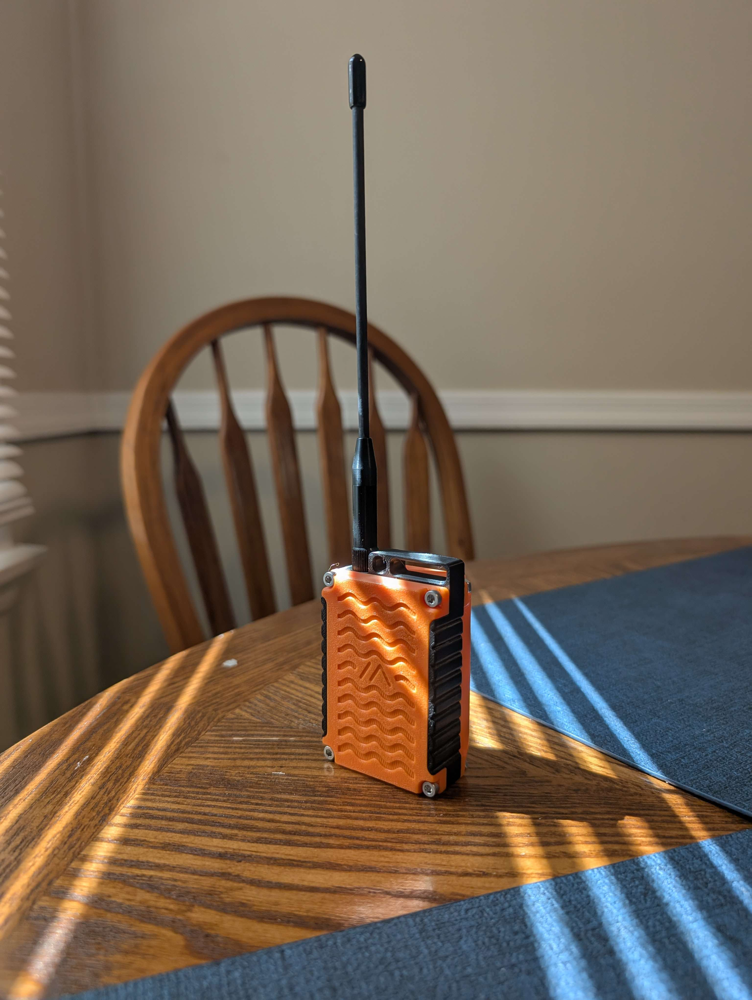

Write the post here in normal Markdown. Headings, lists, links, and images all
work the same way they do elsewhere on the site.

Photos go in `src/assets/` and are referenced with a relative path so Astro
resizes them:

For a photo with a caption under it, rename the file to `.mdx` and use the
Figure component. Everything above still works the same way:

    import Figure from '../../../components/Figure.astro';
    import photo from '../../../assets/news/my-post/photo.JPG';

    <Figure
        src={photo}
        alt="What is in the photo, for anyone who cannot see it."
        caption="The line printed under the photo."
    />

Phone photos are usually 4 to 5 MB. Leave them at full size; the build resizes
them and only ships versions a browser will actually use.
